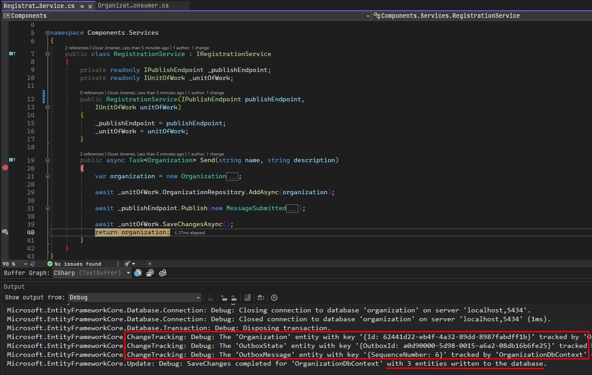
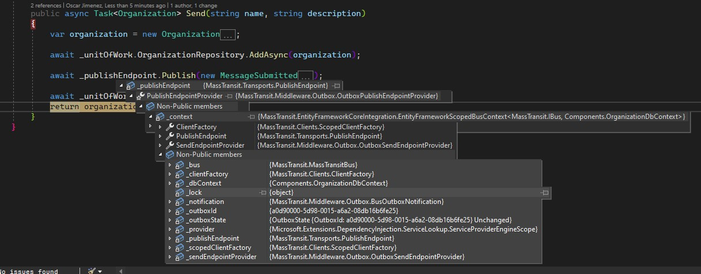
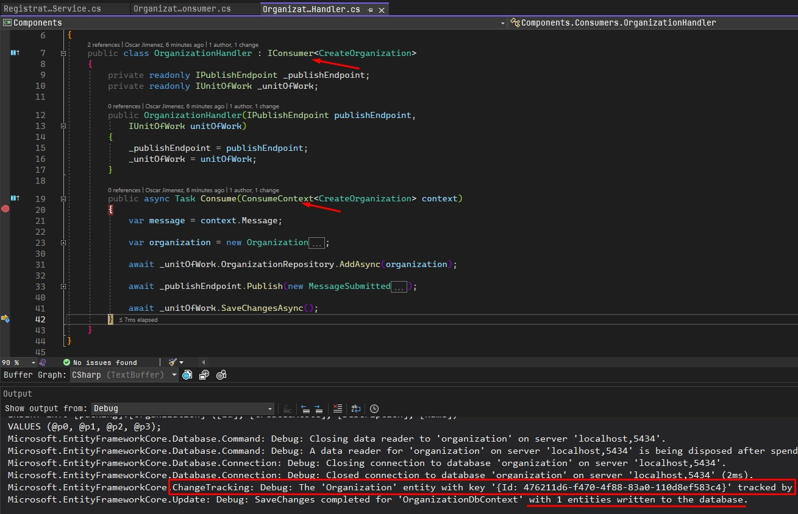
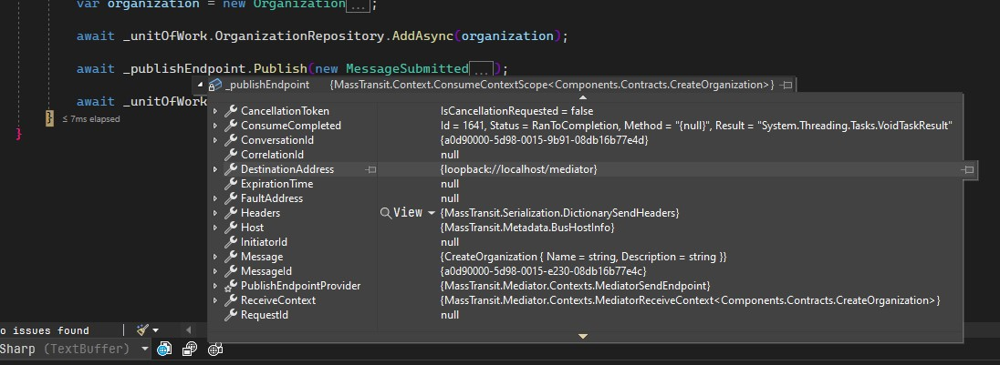

# Masstransit mediator + Masstransit transactional outbox

I am trying to use the Masstransit library and implement the example provided in the link https://github.com/MassTransit/Sample-Outbox, I am also implementing the mediator provided by Masstransit to comunicate my controller layer with the aplication layer, but when executing the project the error is displayed since contexts are different, when I use the mediator, the context is diferent when use a simple service.

- How can I use the two functionalities (Masstransit mediator + Masstransit transactioanl outbox)?
- 

## Masstransit outbox work with a simple service

The masstransit transactional outbox works fine, tracking 3 entities, my organization entity and the OutboxState and OutboxMessage entities

The PublishEndpointProvider has the context joined to the outbox and the dbContext
## Masstransit outbox does not work with mediator

When using the mediator, the process only track 1 entity, my organization entity and the outbox didn't works

The PublishEndpoint has a diferent context and do not have relation with the dbContext.
